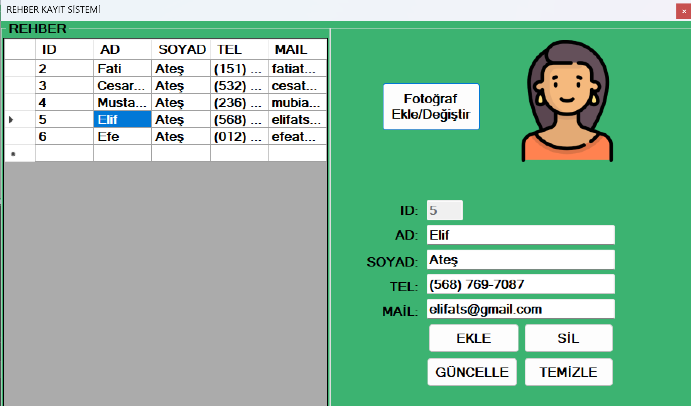

# 📇 Contact Directory Application

A simple **Windows Forms (C#)** application that allows users to manage a personal contact directory with full CRUD functionality and image support. Built using **SQL Server** as the database backend.

---

## Images

---

## 🧩 Features

- ➕ Add new contacts
- 📝 Edit existing contacts
- ❌ Delete contacts
- 🖼️ Upload and display profile pictures
- 📋 View contacts in a data grid
- 🗄️ SQL Server integration

---

## 🛠️ Technologies Used

- C# - Windows Forms (.NET Framework)
- SQL Server - Database storage
- ADO.NET - Data access
- Visual Studio
